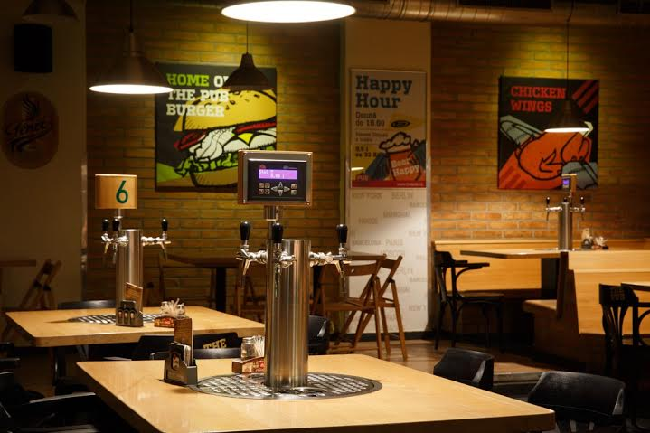

# Pub BlueTeco



> Front-end Pub.

### Ajustes e melhorias

O projeto em desenvolvimento

## 💻 Instalação

```bash
$ git clone https://github.com/brunocarioca021/pub-blue.git
```
```bash
$ npm install
```

## 🚀 Executando o App

```bash
$ npm run start

```

## 📫 Contribuindo para PUB BLUETECO

Para contribuir com Pub BlueTeco, siga estas etapas:

1. Bifurque este repositório.
2. Crie um branch: `git checkout -b <nome_branch>`.
3. Faça suas alterações e confirme-as: `git commit -m '<mensagem_commit>'`
4. Envie para o branch original: `git push origin <main> / <https://github.com/brunocarioca021/api-pub.git>`
5. Crie a solicitação de pull.

Como alternativa, consulte a documentação do GitHub em [como criar uma solicitação pull](https://help.github.com/en/github/collaborating-with-issues-and-pull-requests/creating-a-pull-request).

## 🤝 Colaboradores

Agradecemos às seguintes pessoas que contribuíram para este projeto:

<table>
  <tr>
    <td align="center">
      <a href="#">
        <br>
        <sub>
          <b>Bruno Dutra</b>
        </sub>
      </a>
    </td>
  </tr>
</table>

## 📝 Licença

Nest is [MIT licensed](LICENSE).

[⬆ Voltar ao topo](#blueteco)<br>
